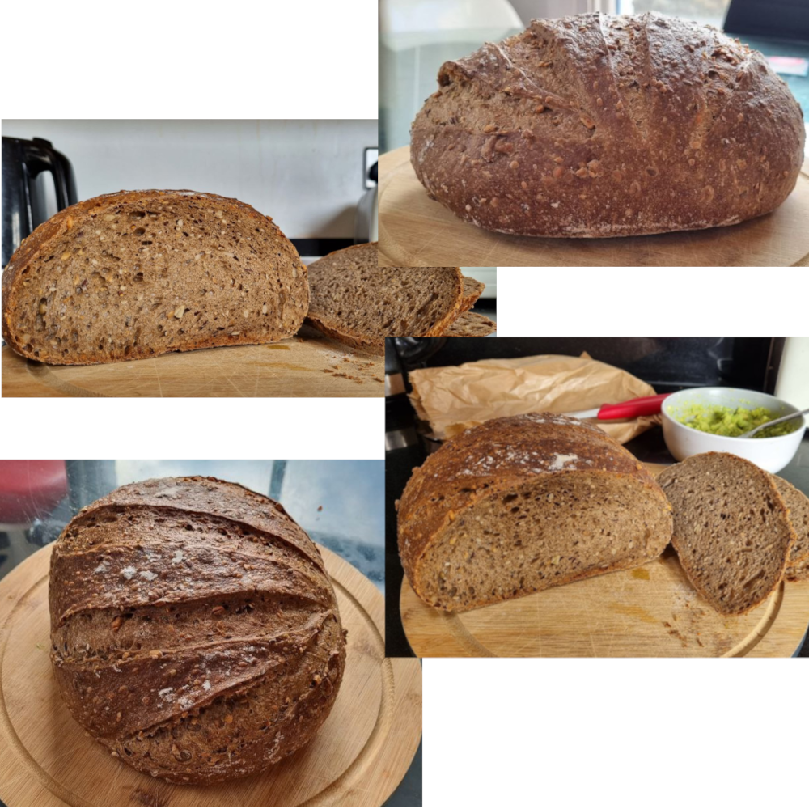
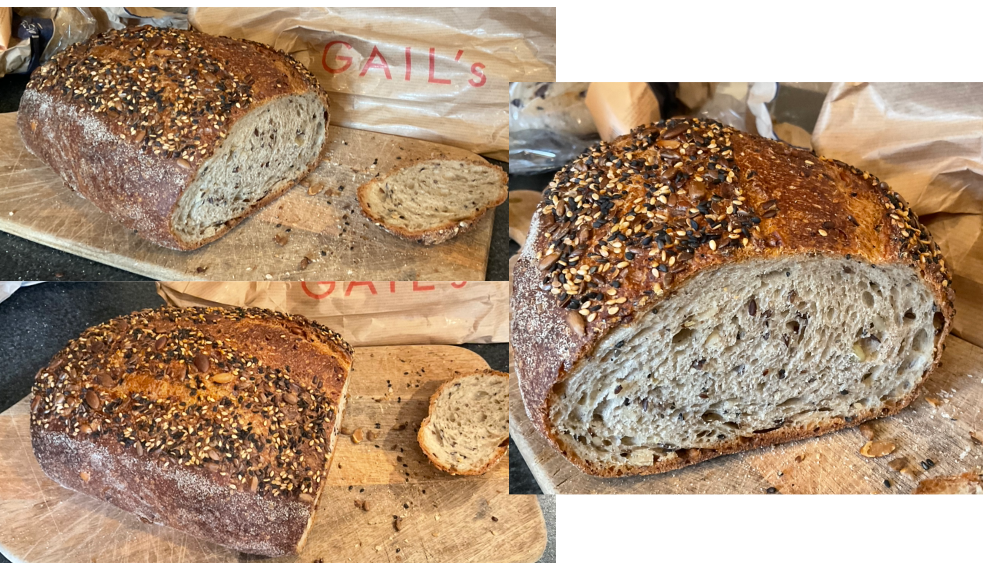
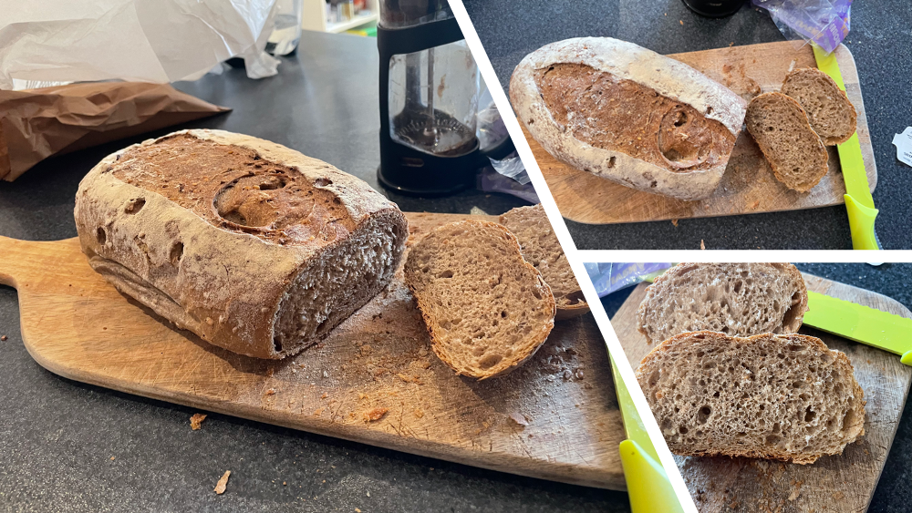
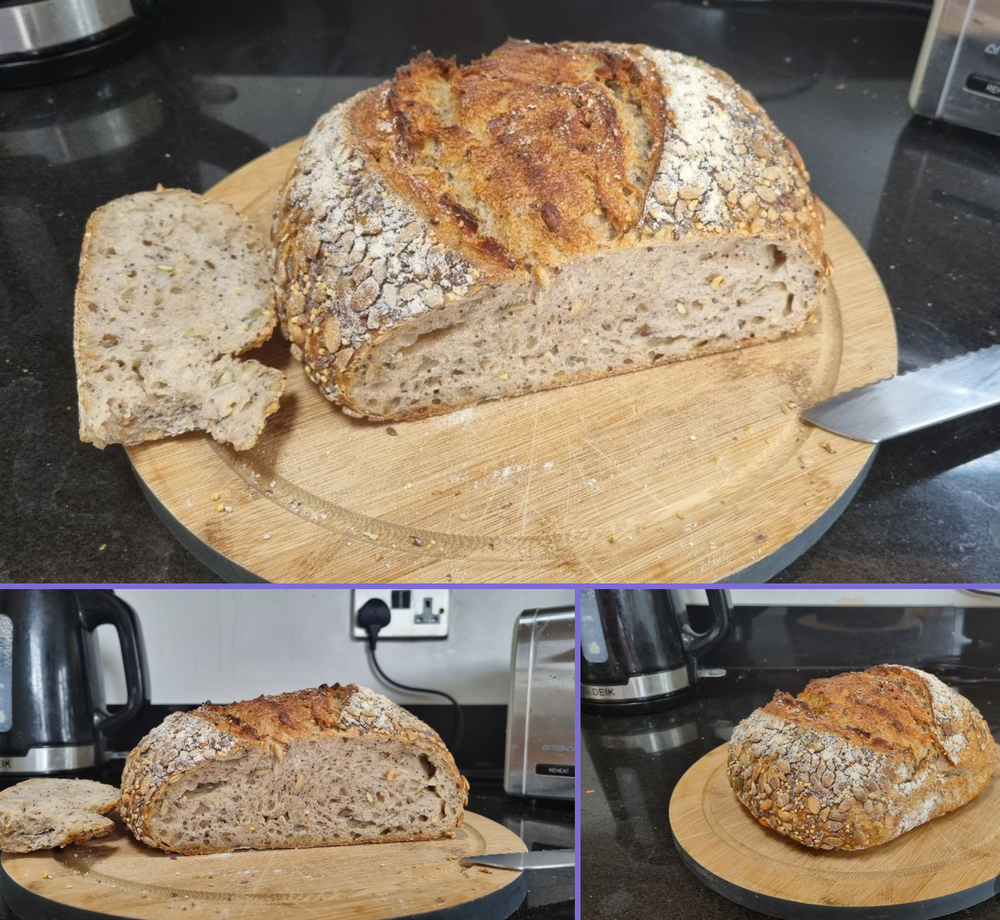

| Name               | Type        | Appearance | Crust         | Crump               | Taste | Comments                                                    | Store                                                   | Price   | Date       | Tester(s) | Pictures                                                               |
|--------------------|-------------|------------|---------------|---------------------|-------|-------------------------------------------------------------|---------------------------------------------------------|---------|------------|-----------|------------------------------------------------------------------------|
| Multi Cereal Large | whole wheat | dark round | firm crunchy  | dense moist fluffy  | 8.5   |                                                             | [Maison Clement](https://goo.gl/maps/v6EYDUFxMnsong6w8) | £5      | 2023-03-01 | Felix     |             |
| Seeded Sourdough   | rye?        | big oval   | firm crunchy  | fluffy spongy seedy | 7     | got dry and hard quickly                                    | [Gail's](https://goo.gl/maps/X2kWVeMCyDNnotKG8)         | ~£6 (?) | 2023-03-08 | Paula     |                |
| Sourdough          | ?           | small oval | dense crunchy | dense dryish        | 6     | kind of boring, but better than toast                       | [Balzanos](https://goo.gl/maps/gBURubj2G51Kia8L9)       | £2.99   | 2023-03-25 | Paula     |                       |
| Seeded Sourdough   | Sourdough   | big round  | crunchy soft  | very soft           | 5.5   | nice seeds on top, inside spongy and soft, quite sour taste | [Hot Numbers](https://goo.gl/maps/x3DRm2WotobozHnZ6)    | £6      | 2023-03-18 | Felix     |  |